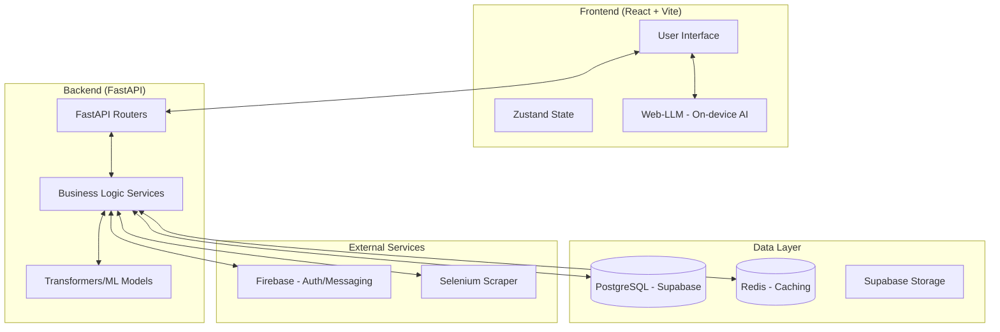

# 🎓 AcaTrack: Academic Performance Tracking & Analytics System

AcaTrack is a comprehensive, full-stack academic management platform designed to provide real-time insights into student performance. Originally developed as a collaborative student management system, it has evolved into a professional-grade analytics engine featuring AI-driven insights, automated data ingestion, and multi-role dashboards.

> [!NOTE]
> This repository serves as the **active solo continuation** and architectural refactor of the original project. It focuses on performance, scalability, and modern engineering practices.

---

### 🏗️ System Architecture



---

### 🛠️ Project Evolution

AcaTrack has undergone a significant architectural transformation to reach its current state:

*   **Phase 1 (Collaborative)**: Initial MVP build focused on core functionality with the original team.
*   **Phase 2 (Solo Refactor)**: Active evolution focused on professional-grade integrity:
    *   **FastAPI Migration**: Replaced the legacy Flask core with **FastAPI** for asynchronous performance and automatic OpenAPI documentation.
    *   **Database Normalization**: Decoupling `students`, `subjects`, and `results` from fixed semester tables for dynamic, multi-year scalability.
    *   **SDK-Driven Frontend**: Implemented automated client SDK generation via **HeyAPI**, ensuring 100% type safety between backend and frontend.
    *   **Strict Type Safety**: Migrated the entire frontend to **TypeScript** with strict null checks and centralized interface definitions.
    *   **State-Driven Authentication**: Refactored staff login to utilize a dynamic batch filter in the dashboard, replacing static legacy selections.
    *   **Performance Engineering**: Integrated **Redis caching**, resolved N+1 query issues, and switched to **uv** for lightning-fast package resolution.
    *   **UI/UX Modernization**: Transitioned to a **Bento-box dashboard layout**, implemented **code-splitting** (React.lazy), and redesigned result views with Lucide icons.
    *   **Containerization**: Implemented **Docker** and **Docker Compose** for standardized deployment across all environments.

---

### 👥 Role-Based Access Control (RBAC)

AcaTrack provides specialized interfaces for four key stakeholders:

*   **👨‍🎓 Student Portal**: View academic results (SGPA/CGPA), track progress via visual graphs, download **auto-generated PDF reports**, access shared study materials, and receive personalized AI insights.
*   **👨‍👩‍👧 Parent Portal**: Secure access for parents to monitor their ward's academic standing, attendance trends, and semester-wise results in real-time.
*   **🤝 Mentor/Staff Dashboard**: Manage student groups, log mentorship meetings, fill student records, **upload study materials**, and communicate via integrated email services.
*   **🛡️ Admin Panel**: Centralized control for user management, batch data processing, university data scraping, and system configuration.

> [!TIP]
> **Localization**: The platform provides full multi-language support for **English, Hindi, and Kannada**, ensuring accessibility for a diverse user base.

---

### 🤖 AI & Predictive Analytics

AcaTrack integrates advanced AI capabilities to move beyond simple data storage:

*   **Smart Performance Prediction**: Machine learning models analyze historical data to predict future performance trends and identify at-risk students early.
*   **Automated Insights**: On-device (Web-LLM) and backend (Transformers) AI provide natural language summaries of academic results and suggest personalized study focus areas.
*   **University Benchmarking**: Intelligent comparison engine to evaluate student and subject performance against **university-wide averages** and historical trends.
*   **Intelligent Chatbot**: A contextual AI assistant capable of answering student queries about their academic record and university regulations.

---

### 📥 Data Processing Pipeline

The system features robust tools for handling complex academic data:

*   **Automated Web Scraping**: Integrated Selenium-based scrapers to fetch the latest university results and data directly from official portals.
*   **PDF to Data Conversion**: Advanced parsing tools using `PyMuPDF` to convert structured PDF result sheets into clean, manageable Excel or Database records.
*   **Excel Ingestion**: Bulk upload capabilities for student records, staff lists, and subject mappings with automated validation.

---

### 📦 Tech Stack

#### **Frontend**
*   **Framework**: `React` (with TypeScript)
*   **Build Tool**: `Vite` — Blazing fast HMR and optimized builds.
*   **Styling**: `Tailwind CSS v4` — Utility-first styling with modern CSS features.
*   **State Management**: `Zustand` — Minimalistic and scalable state handling.
*   **AI**: `Web-LLM` — High-performance on-device LLM integration.
*   **Networking**: `Axios` with generated SDK via `HeyAPI`.

#### **Backend**
*   **Framework**: `FastAPI` — High-performance Python web framework.
*   **Package Manager**: `uv` — Ultra-fast Python package installer and resolver.
*   **Server**: `Uvicorn` with `uvloop` and `httptools`.
*   **ORM**: `SQLAlchemy 2.0` with `Alembic` for migrations.
*   **Caching**: `Redis` for optimized API response times.
*   **AI/ML**: `Transformers`, `scikit-learn`, and `pandas`.

#### **Infrastructure & Services**
*   **Database**: `PostgreSQL` (hosted via **Supabase**).
*   **Auth**: **Supabase Auth** & **Firebase**.
*   **Reporting**: `Matplotlib` (visuals) and `ReportLab`/`PyMuPDF` (PDF generation).
*   **DevOps**: `Docker` & `Docker Compose`.

---

### 🛠️ Development & Workflow

The project uses a `Makefile` to standardize common operations across the stack.

| Command | Action |
| :--- | :--- |
| `make install` | Install all backend (`uv`) and frontend (`npm`) dependencies. |
| `make run` | Launch both FastAPI and Vite servers concurrently. |
| `make backend` | Start the FastAPI development server (port 5000). |
| `make frontend` | Start the Vite development server. |
| `make test` | Run the comprehensive backend test suite. |
| `make benchmark` | Execute database and query performance benchmarks. |
| `make load-test` | Run high-concurrency performance tests using `k6`. |
| `make docker-up` | Spin up the entire stack using Docker Compose. |
| `make clean` | Purge cache files and virtual environments. |

---

### 🚀 Getting Started

#### **Prerequisites**
*   **Python 3.10+** (managed via `uv` recommended)
*   **Node.js (v18+)**
*   **Docker** (optional, for containerized execution)

#### **Manual Execution**

1.  **Environment Setup**:
    Copy the `.env.example` files in both `backend/` and `frontend/` and fill in your credentials.
    ```bash
    cp backend/.env.example backend/.env
    cp frontend/.env.example frontend/.env
    ```

2.  **Installation**:
    ```bash
    make install
    ```

3.  **Run Development Servers**:
    ```bash
    make run
    ```

---

### ⚙️ Environment Configuration

| Variable | Description |
| :--- | :--- |
| `DATABASE_URL` | PostgreSQL connection string (Supabase). |
| `REDIS_URL` | Redis connection string for caching. |
| `FIREBASE_CRED_PATH` | Path to Firebase Admin SDK JSON. |
| `SUPABASE_URL` / `KEY` | Connection details for Supabase services. |
| `CORS_ALLOWED_ORIGINS` | Comma-separated list of allowed origins. |

---

### ⚡ Performance & Reliability

AcaTrack is engineered for high performance and reliability, with a focus on low latency and high concurrency.

#### **Benchmarking: Legacy (Flask) vs. Modern (FastAPI)**
The following metrics were captured using **k6** across comparable high-concurrency scenarios (120+ requests):

| Metric | Legacy (v1) | **AcaTrack (v2)** | **Improvement** |
| :--- | :--- | :--- | :--- |
| **Throughput (RPS)** | 1.84 | **59.62** | **~32x Increase** |
| **Avg. Response Time** | 2,840 ms | **158.79 ms** | **~18x Faster** |
| **Success Rate** | 96.77% | **100.00%** | **Perfect Reliability** |
| **Avg. DB Connections** | 42 | **5** | **8.4x More Efficient** |

*   **Optimized Execution**: Migrated to **FastAPI** with **Uvloop** and **Httptools**, delivering significantly higher throughput compared to the legacy Flask implementation.
*   **Advanced Caching**: Implemented **Redis-based caching** for expensive academic result computations and university data fetching.
*   **Database Efficiency**: Resolved critical **N+1 query bottlenecks** using SQLAlchemy joined-loading and optimized database indexing.
*   **Load Tested**: Verified to handle high-concurrency scenarios via **k6** load testing, ensuring stability during peak result periods.
*   **Automated Benchmarking**: Continuous monitoring via `benchmarkv2.py` to ensure query latency remains within professional standards (metrics tracked for database and API response times).

---

### 📂 Project Structure

```text
├── backend/            # FastAPI source code, models, services, and routes
├── frontend/           # React + Vite source code and assets
├── scripts/            # Database seeding and utility scripts
├── docker-compose.yml  # Container orchestration
├── Makefile            # Standardized task automation
├── openapi.json        # Generated API documentation
└── load_testv2.js      # Performance testing script
```

---

### 👥 Contributors (Legacy)
*   **Lead Maintainer**: Chetan Kishor C G
*   **Collaborators**: Abhishek R, Dhanush Singh G, Adithya V

---

### 🤍 Evolution
This project began as a student group assignment and have been refactoring into a modern, production-ready system. It represents a journey from learning full-stack basics to implementing advanced patterns like RBAC, AI integration, and high-performance caching.
