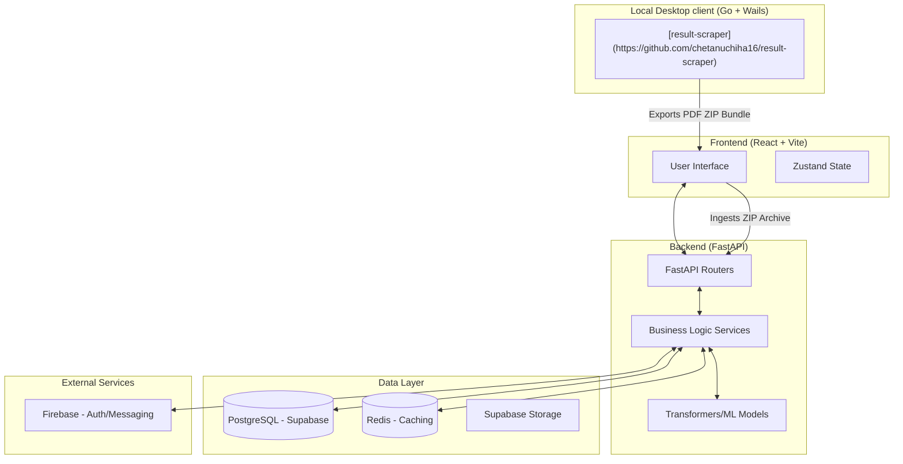

# 🎓 AcaTrack: Academic Performance Tracking & Analytics System

[](https://huggingface.co/spaces/chetanuchiha16/acatrack)

AcaTrack is an academic performance tracking and analytics platform. It features an asynchronous API, real-time analytics, multi-tenant role-based access control, and modular database architectures.

> [!NOTE]
> This repository is the official home of AcaTrack, built with a focus on performance, scalability, and modern software engineering practices.

> [!IMPORTANT]
> **Scraper Decoupling**: The legacy server-side Selenium-based scraper has been deprecated and completely migrated to our standalone, high-performance desktop application: **[VTU Result Scraper](https://github.com/chetanuchiha16/result-scraper)**. This eliminates CAPTCHA, browser rendering, and server-side CPU bottlenecks.

---

### 🏗️ System Architecture



---

### 🛠️ Project Evolution

AcaTrack has undergone a comprehensive engineering evolution to optimize performance and reliability:

*   **FastAPI Core Migration**: Replaced the legacy prototype Flask-based API layer with **FastAPI** for native asynchronous operations, automatic validation, and standardized OpenAPI documentation.
*   **Database Normalization**: Restructured legacy flat schemas by decoupling `students`, `subjects`, and `results` into distinct database tables, facilitating dynamic multi-year academic scalability.
*   **SDK-Driven Client Architecture**: Integrated automated client SDK generation via **HeyAPI**, ensuring complete type safety between python models and the typescript frontend.
*   **Strict Type-Safe UI**: Ported the user portal codebase to **TypeScript** with strict compiler guidelines and static interfaces.
*   **State-Driven Dashboards**: Replaced static access layers with dynamic, state-driven role selectors and filters powered by Zustand.
*   **Performance Optimization**: Integrated **Redis caching** for hot database paths and resolved nested database N+1 query patterns.
*   **High-Performance Standalone Rust Core**: Extracted and modularized parallel VTU PDF parsing into a standalone **Rust parsing engine ([acatrack-pdf-parser-rs](https://github.com/chetanuchiha16/acatrack-pdf-parser-rs))** compiled via PyO3 & Rayon, achieving a **38.4x** parsing throughput speedup.
*   **UI/UX Modernization**: Redesigned front-facing modules using a modern Bento-box grid, integrated lazy-loaded code-splitting, and adopted a premium liquid glassmorphic design system.
*   **Containerized Environments**: Packaged the entire multi-service workspace using **Docker** and **Docker Compose** for seamless environment setup.

---

### 👥 Role-Based Access Control (RBAC)

AcaTrack provides specialized interfaces for four key stakeholders:

*   **👨‍🎓 Student Portal**: View academic results (SGPA/CGPA), track progress via visual graphs, download **auto-generated PDF reports**, access shared study materials, and receive personalized AI insights.
*   **👨‍👩‍👧 Parent Portal**: Secure access for parents to monitor their ward's academic standing, attendance trends, and semester-wise results in real-time.
*   **🤝 Mentor/Staff Dashboard**: Manage student groups, log mentorship meetings, fill student records, **upload study materials**, and communicate via integrated email services.
*   **🛡️ Admin Panel**: Centralized control for user management, batch data processing, university data scraping, and system configuration.

> [!TIP]
> **Localization**: The platform provides full multi-language support for **English, Hindi, and Kannada**, ensuring accessibility for a diverse user base.

---

### 🤖 AI & Predictive Analytics

AcaTrack integrates advanced AI capabilities to move beyond simple data storage:

*   **Smart Performance Prediction**: Machine learning models analyze historical data to predict future performance trends and identify at-risk students early.
*   **Automated Insights**: Backend-driven AI (Transformers/ML) provides natural language summaries of academic results and suggests personalized study focus areas.
*   **University Benchmarking**: Intelligent comparison engine to evaluate student and subject performance against **university-wide averages** and historical trends.

---

### 📥 Data Processing Pipeline

The system features robust tools for handling complex academic data:

*   **Standalone Desktop Scraping**: Leverage our dedicated, native Go + Wails cross-platform **[VTU Result Scraper](https://github.com/chetanuchiha16/result-scraper)** for local scraping, CAPTCHA resolution, and local PDF packaging.
*   **PDF to Data Conversion**: Parallel extraction using our custom compiled, standalone **Rust engine ([acatrack-pdf-parser-rs](https://github.com/chetanuchiha16/acatrack-pdf-parser-rs) via PyO3 & Rayon)**, published directly to **PyPI** for zero-dependency high-speed ingestion.
*   **Excel Ingestion**: Bulk upload capabilities for student records, staff lists, and subject mappings with automated validation.

---

### 📦 Tech Stack

#### **Frontend**
*   **Framework**: `React` (with TypeScript)
*   **Build Tool**: `Vite` — Fast HMR and optimized builds.
*   **Styling**: `Tailwind CSS v4` — Utility-first styling with modern CSS features.
*   **State Management**: `Zustand` — Minimalistic state handling.
*   **Networking**: `Axios` with generated SDK via `HeyAPI`.

#### **Backend**
*   **Framework**: `FastAPI` — High-performance Python web framework.
*   **Core Parser**: `Rust` bridged via `PyO3` & `Rayon` for multi-threaded parallel PDF parsing.
*   **Package Manager**: `uv` — Fast Python package installer and resolver.
*   **Server**: `Uvicorn` with `uvloop` and `httptools`.
*   **ORM**: `SQLAlchemy 2.0` with `Alembic` for migrations.
*   **Caching**: `Redis` for optimized API response times.
*   **AI/ML**: `Transformers`, `scikit-learn`, and `pandas`.

#### **Infrastructure & Services**
*   **Database**: `PostgreSQL` (hosted via **Supabase**).
*   **Reporting**: `Matplotlib` (visuals) and `ReportLab`/`PyMuPDF` (PDF generation).
*   **DevOps**: `Docker` & `Docker Compose`.

---

### 🛠️ Development & Workflow

The project uses a `Makefile` to standardize common operations across the stack.

| Command | Action |
| :--- | :--- |
| `make install` | Install all backend (`uv`) and frontend (`npm`) dependencies. |
| `make run` | Launch both FastAPI and Vite servers concurrently. |
| `make backend` | Start the FastAPI development server (port 5000). |
| `make frontend` | Start the Vite development server. |
| `make test` | Run the comprehensive backend test suite. |
| `make benchmark` | Execute database and query performance benchmarks. |
| `make load-test` | Run high-concurrency performance tests using `k6`. |
| `make docker-up` | Spin up the entire stack using Docker Compose. |
| `make clean` | Purge cache files and virtual environments. |

---

### 🚀 Getting Started

#### **Prerequisites**
*   **Python 3.10+** (managed via `uv` recommended)
*   **Node.js (v18+)**
*   **Docker** (optional, for containerized execution)

#### **Manual Execution**

1.  **Environment Setup**:
    Copy the `.env.example` files in both `backend/` and `frontend/` and fill in your credentials.
    ```bash
    cp backend/.env.example backend/.env
    cp frontend/.env.example frontend/.env
    ```

2.  **Installation**:
    ```bash
    make install
    ```

3.  **Run Development Servers**:
    ```bash
    make run
    ```

---

### ⚙️ Environment Configuration

| Variable | Description |
| :--- | :--- |
| `DATABASE_URL` | PostgreSQL connection string (Supabase). |
| `REDIS_URL` | Redis connection string for caching. |
| `FIREBASE_CRED_PATH` | Path to Firebase Admin SDK JSON. |
| `SUPABASE_URL` / `KEY` | Connection details for Supabase services. |
| `CORS_ALLOWED_ORIGINS` | Comma-separated list of allowed origins. |

---

### ⚡ Performance & Reliability

AcaTrack includes optimizations focused on request latency and concurrency.

#### **Benchmarking: Legacy (Flask) vs. Modern (FastAPI)**
The following metrics were captured using **k6** across comparable high-concurrency scenarios (120+ requests):

| Metric | Legacy (v1) | **AcaTrack (v2)** | **Improvement** |
| :--- | :--- | :--- | :--- |
| **Throughput (RPS)** | 1.84 | **59.62** | **32.4x higher** |
| **Avg. Response Time** | 2,840 ms | **158.79 ms** | **17.9x faster** |
| **Success Rate** | 96.77% | **100.00%** | **0% error rate** |
| **Avg. DB Connections** | 42 | **5** | **8.4x fewer connections** |

#### **Benchmarking: Sequential Python Parser vs. Parallel Rust Core**
The following metrics show the dramatic performance boost after migrating the CPU-bound VTU result PDF scraping pipeline to a parallel Rust core bridged via PyO3 (benchmarked over 1,308 PDFs across 4 ZIP upload requests):

| Metric | Sequential Python (pdfplumber) | **Parallel Rust Core (PyO3 + Rayon)** | **Improvement** |
| :--- | :--- | :--- | :--- |
| **Total Parsing Duration** | 21.78 minutes | **34.06 seconds (~0.57 min)** | **38.4x speedup** |
| **Speed per PDF** | 0.9992 seconds | **0.0260 seconds** | **38.4x speedup** |
| **Upload p(95) Latency** | 10,598 ms | **5,534 ms** | **1.91x speedup** |
| **Net RAM Impact** | +268.48 MB | **+76.43 MB** | **71.5% reduction** |

*   **Optimized Execution**: Migrated to **FastAPI** with **Uvloop** and **Httptools**, delivering significantly higher throughput compared to the legacy Flask implementation.
*   **Advanced Caching**: Implemented **Redis-based caching** for expensive academic result computations and university data fetching.
*   **Database Efficiency**: Resolved critical **N+1 query bottlenecks** using SQLAlchemy joined-loading and optimized database indexing.
*   **Load Tested**: Verified to handle high-concurrency scenarios via **k6** load testing, ensuring stability during peak result periods.
*   **Automated Benchmarking**: Continuous monitoring via `benchmarkv2.py` to track database and API response times.

---

### 📂 Project Structure

```text
├── backend/            # FastAPI backend source code (models, services, routes)
├── frontend/           # React + Vite frontend source code and assets
├── benchmarks/         # Performance benchmarking scripts (database, queries, and APIs)
├── load_tests/         # Concurrency and load testing scripts (k6 integration)
├── scratch/            # Temporary experimental scripts, test runs, and logs
├── docker-compose.yml  # Containerized local environment orchestration
├── Makefile            # Project automation task execution engine
└── openapi.json        # Generated OpenAPI contract specification
```

---

*   **Author & Owner**: Chetan Kishor C G
