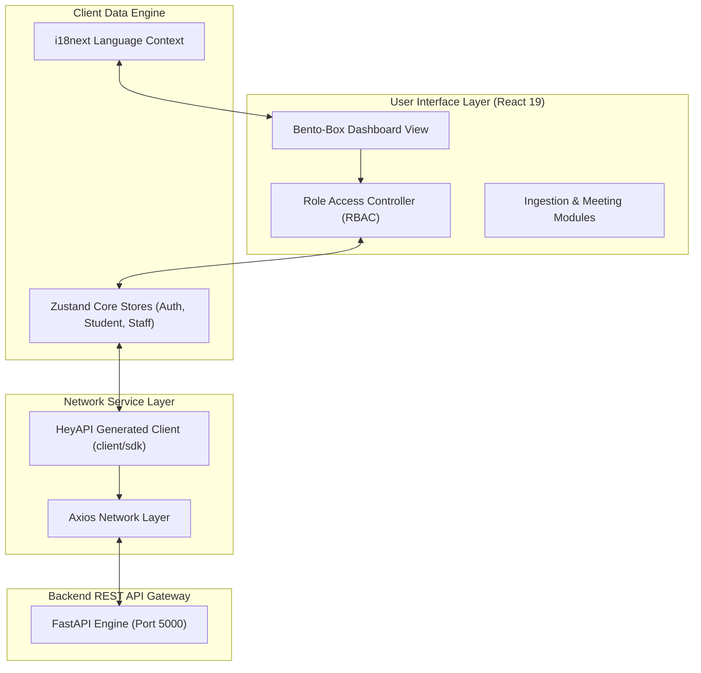

# 🎨 AcaTrack Frontend — React & TypeScript Client

[](https://react.dev/)
[](https://www.typescriptlang.org/)
[](https://vite.dev/)
[](https://tailwindcss.com/)
[](https://zustand.docs.pmnd.rs/)
[](https://heyapi.dev/)
[](https://www.i18next.com/)

AcaTrack Frontend is the premium, responsive dashboard interface of the AcaTrack ecosystem. Built on **React 19**, **Vite**, and **TypeScript**, it features a modular Bento-box layout, responsive micro-animations, multi-language localization, and a **100% type-safe API SDK** generated dynamically via HeyAPI from the backend's OpenAPI schema.

---

## 🏛️ Architecture & Core Paradigms

The frontend client serves as a decoupled, single-page application (SPA) executing role-based view layouts. It integrates with native desktop applications (Wails result scraper) and directly queries the FastAPI backend service.



---

## 🌟 Key Frontend Features

*   **Type-Safe SDK Generation**: Eliminates manually defined interface models by using **HeyAPI OpenAPI-TS** to automatically compile TypeScript types and client operations directly from the backend's `openapi.json` contract.
*   **Decoupled Zustand Stores**: State management is split into three highly isolated, high-performance stores (`useAuthStore`, `useStudentStore`, and `useStaffStore`) to govern role contexts, tokens, cache structures, and layout filters without standard React Context rendering overhead.
*   **Bento-Box Responsive Dashboard**: Formed using standard glassmorphism elements, custom dark modes, and curated harmonious HSL colors optimized dynamically via **Tailwind CSS v4**.
*   **Role-Based Access Control (RBAC)**: Protects application sections at the router tier, enforcing specific dashboards for:
    *   **Students**: View individual results, access predictions, consult academic chatbots, and download PDFs.
    *   **Parents**: Retrieve links to linked student records and direct messaging details for assigned mentors.
    *   **Staff/Mentors**: Coordinate meetings, review mentee record PDF trees, list details, upload files, and send broadcasts.
    *   **Admins**: Trigger batch creations, initialize schemas, and configure subject allocations.
*   **Instant Multi-Language Localization**: Full translation frameworks for **English, Hindi, and Kannada** managed at runtime using `react-i18next`.
*   **High-Volume Virtualized Lists**: Renders heavy academic records, topper tables, and transaction history cards cleanly utilizing `react-window` and `react-virtualized-auto-sizer` for low memory impact and smooth scrolling.
*   **Advanced Code Splitting**: Fine-tuned chunk splitting inside `vite.config.ts` divides major modules (React core, React Router, Firebase SDKs, ExcelJS, and icon packs) into isolated bundles, drastically reducing initial page load times.

---

## 📂 Frontend Project Structure

```text
frontend/
├── public/              # Static assets (images, localized templates, SVGs)
├── src/
│   ├── client/          # 100% Type-Safe API client generated by HeyAPI openapi-ts
│   │   ├── services.ts  # Auto-compiled API request operations
│   │   ├── models.ts    # Auto-compiled TypeScript definitions
│   │   └── sdk.gen.ts   # Core HeyAPI Axios request client
│   ├── components/      # Reusable UI Components
│   │   ├── admin/       # Sub-components for batch allocation & assignments
│   │   ├── staff/       # Meeting dialogs & email forms
│   │   ├── student/     # Inline result tables & performance graphs
│   │   └── ui/          # Standard design components (Buttons, Modals, Loaders)
│   ├── layouts/         # Frame structures (Sidebar, Headers, Footer)
│   ├── locales/         # i18n localization JSON mappings (EN, HI, KN)
│   ├── pages/           # High-level route pages categorized by RBAC role
│   │   ├── admin/       # Admin configuration dashboard pages
│   │   ├── auth/        # Login, Reset Password, Session handlers
│   │   ├── parent/      # Parents ward portals
│   │   ├── staff/       # Mentor panels & meeting lists
│   │   └── student/     # Student portal pages & AI chatbot
│   ├── router/          # React Router configurations & RBAC guard wrappers
│   ├── store/           # Centralized Zustand Core stores
│   │   ├── useAuthStore.ts    # JWT, session persistence, and logout flow
│   │   ├── useStaffStore.ts   # Mentees list, messages, and meeting states
│   │   └── useStudentStore.ts # Results arrays, trends, and charts state
│   ├── styles/          # Custom utility stylings
│   ├── types/           # Core static TypeScript type definitions
│   ├── utils/           # Helper scripts (grade mapping, PDF converters)
│   ├── config.ts        # Static mapping configuration and base constants
│   ├── firebase.ts      # Firebase push notification initialize script
│   ├── i18n.ts          # i18next engine configurations
│   ├── App.tsx          # Main entry wrapper and Toastify layout
│   └── main.tsx         # Root renderer & routing anchor
├── index.html           # Root HTML entry template
├── openapi-ts.config.ts # HeyAPI OpenAPI compilation setup parameters
├── tsconfig.json        # Main TypeScript configuration
├── vercel.json          # Deployment routing overrides for Vercel
├── package.json         # Package scripts and dependency versions
└── vite.config.ts       # Vite plugins, manual chunk splitting & styling configs
```

---

## ⚙️ Environment Configuration

The client requires an API endpoint url parameter defined in a local `.env` file at the frontend directory.

### Configuration Variable

| Variable | Example Value | Description |
| :--- | :--- | :--- |
| `VITE_API_BASE` | `http://localhost:5000` | Points to your running AcaTrack FastAPI backend server. |

---

## 🚀 Setting Up & Running Locally

### 1. Dependency Installation
Ensure you have Node.js (v18+) installed. Install all locked dependencies:
```bash
# In the frontend/ directory:
npm install

# Or use the project root Makefile
make install
```

### 2. Generating the Type-Safe SDK Client
To generate or refresh the Axios API SDK client based on the current backend specification, run the HeyAPI script:
```bash
# Triggers the openapi-ts compiler to sync backend/openapi.json to src/client/
npx @hey-api/openapi-ts

# Or trigger the build scripts directly
npm run dev
```

### 3. Launching the Development Server
Fire up the Vite local developer engine:
```bash
# Start local HMR dev server (usually binds to port 5173)
npm run dev

# Or use the root Makefile
make frontend
```
Open **[http://localhost:5173](http://localhost:5173)** in your browser to view the dashboard!

---

## 🛠️ Developer Workflows

### 🧹 Linting & Code Hygiene
Check the codebase for type and style conformances using ESLint:
```bash
# Runs the linter on all typescript and JSX elements
npm run lint
```

### 📦 Building for Production
Pre-render static files and optimize codebases for production distribution:
```bash
# Compiles React files into an optimized /dist static bundle
npm run build

# Preview the built production application locally
npm run preview
```

---

## 🛠️ Core Tech Stack & Libraries

*   **Vite 7**: Ultra-fast bundle building and instant Hot Module Replacement (HMR).
*   **React 19**: Modern declarative UI design utilizing standard React hooks.
*   **TypeScript 5**: Complete static type-safety across components, states, and routes.
*   **Zustand v5**: Extremely lightweight, hook-based state engine that avoids unnecessary parent re-renders.
*   **Tailwind CSS v4**: Modern CSS-first processing utilizing fluid layout utilities.
*   **HeyAPI Client Axios**: High-speed REST network clients mapped directly to backend types.
*   **ExcelJS**: Parses client-side spreadsheets to convert data in bulk before ingestion.
*   **React-Window**: Core list virtualization utility that prevents DOM bloat.
*   **Lucide React & React Icons**: Sleek SVG dynamic icons.
*   **React Toastify**: Smooth status notifications.
*   **i18next**: Standardized internationalization wrapper.
*   **Firebase**: Dynamic notifications receiver.

---

> [!TIP]
> Keep your backend running on `http://localhost:5000` while working on the frontend to ensure that API requests, token verifications, and AI model predictions resolve correctly.
